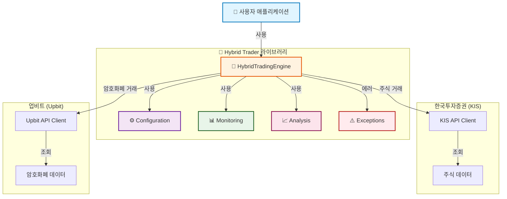
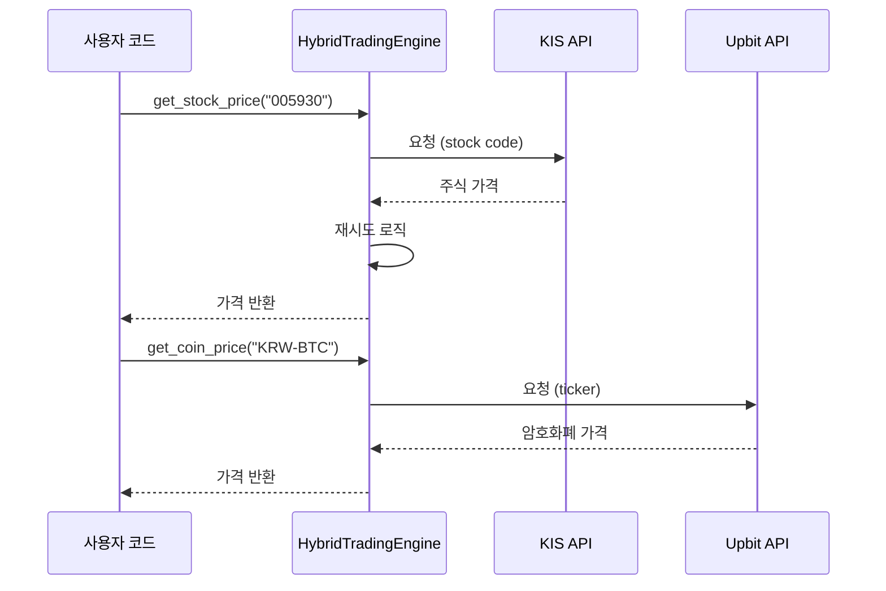
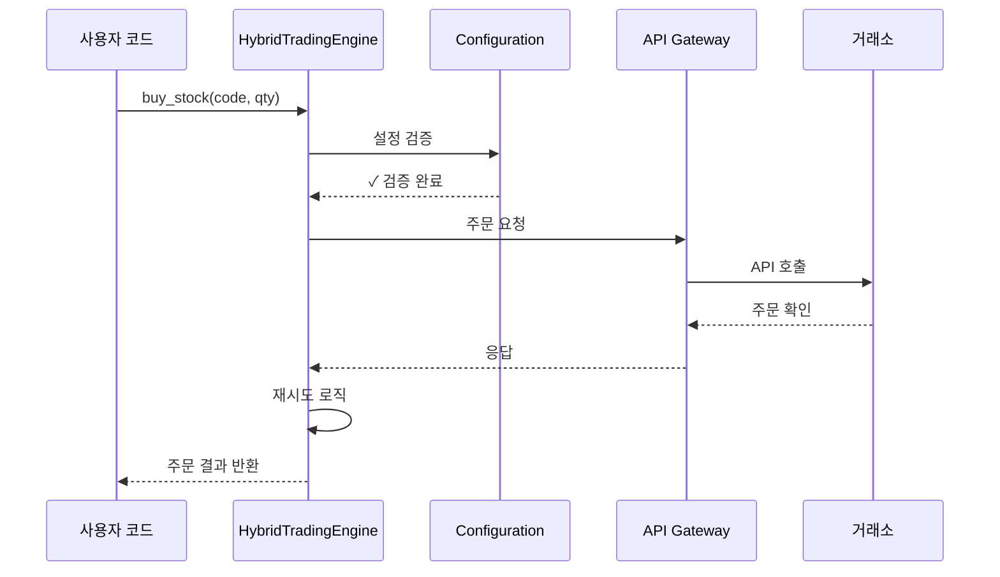
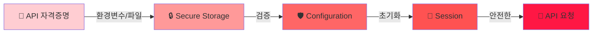

# 아키텍처 및 설계

Hybrid Trader의 시스템 구조 및 설계 원리를 소개합니다.

## 🏗️ 전체 아키텍처



## 📦 핵심 컴포넌트

### 1. HybridTradingEngine

**역할**: 메인 인터페이스로서 KIS와 Upbit API를 통합 관리

```
HybridTradingEngine
├── 초기화 (Configuration 검증)
├── KIS API 관리
│   ├── 주식 가격 조회
│   ├── 주문/취소
│   └── 포지션 조회
├── Upbit API 관리
│   ├── 암호화폐 가격 조회
│   ├── 주문/취소
│   └── 잔고 조회
└── 세션 관리 (Context Manager)
```

### 2. Configuration (설정)

**역할**: API 자격증명 및 설정 관리

```
TradingConfig
├── KISConfig
│   ├── app_key
│   ├── secret_key
│   ├── account_number
│   ├── hts_id
│   └── is_demo (테스트 모드)
└── UpbitConfig
    ├── access_key
    └── secret_key
```

### 3. Monitoring (모니터링)

**역할**: 실시간 데이터 추적 및 포트폴리오 분석

```
PriceMonitor
├── 실시간 가격 추적
├── 가격 변동 알림
└── 거래 이력 기록

PortfolioMonitor
├── 포트폴리오 구성 조회
├── 평가손익 계산
└── 성능 분석
```

### 4. Analysis (분석)

**역할**: 거래 데이터 분석 및 인사이트 제공

### 5. Exceptions (예외)

**역할**: 커스텀 예외 처리로 명확한 에러 메시지 제공

```
HybridTraderException (기본 예외)
├── InvalidTickerError (유효하지 않은 티커)
├── APIConnectionError (API 연결 오류)
├── ConfigurationError (설정 오류)
└── SessionNotInitializedError (세션 미초기화)
```

## 🔄 데이터 흐름

### 가격 조회 흐름



### 주문 흐름



## 💾 데이터 모델

### Config 데이터 모델

```python
@dataclass
class KISConfig:
    app_key: str          # API 앱 키
    secret_key: str       # API 비밀 키
    account_number: str   # 거래 계좌 번호
    hts_id: str          # HTS 로그인 ID
    is_demo: bool = False # 테스트 모드 여부

@dataclass
class UpbitConfig:
    access_key: str      # API Access 키
    secret_key: str      # API 비밀 키

@dataclass
class TradingConfig:
    kis_config: KISConfig
    upbit_config: UpbitConfig
```

### 모니터링 데이터 모델

```python
@dataclass
class PriceSnapshot:
    timestamp: datetime
    ticker: str
    price: float
    volume: float
    change: float

@dataclass
class PortfolioSnapshot:
    total_valuation: float      # 총 자산가
    cash_balance: float         # 현금
    profit_loss: float          # 평가손익
    profit_loss_rate: float     # 수익률 (%)
    positions: List[Position]   # 보유 포지션
```

## 🔐 보안 아키텍처



### 보안 특징

1. **자격증명 격리**: 자격증명은 메모리에만 존재
2. **환경변수 사용**: 하드코딩 방지
3. **세션 정리**: with 문으로 자동 정리
4. **타입 검증**: 설정 클래스로 타입 안정성
5. **에러 핸들링**: 민감한 정보를 노출하지 않음

## 🚀 성능 최적화

### 1. Lazy Loading (지연 로딩)

```python
# API 세션은 첫 사용 시에만 생성
@property
def kis_session(self):
    if self._kis_session is None:
        self._kis_session = kis.KISClient(...)
    return self._kis_session
```

**장점:**
- 불필요한 연결 방지
- 초기화 시간 단축
- 메모리 효율성

### 2. Connection Pooling

```
┌─────────────────────────────────────┐
│  Hybrid Trader Engine               │
│  ┌──────────────────────────────┐  │
│  │ Session Pool                 │  │
│  ├──────────────────────────────┤  │
│  │ KIS Connection (재사용)      │  │
│  │ Upbit Connection (재사용)    │  │
│  └──────────────────────────────┘  │
└─────────────────────────────────────┘
```

### 3. 재시도 로직

```python
def _retry_with_backoff(func, max_retries=3):
    for attempt in range(max_retries):
        try:
            return func()
        except APIConnectionError:
            if attempt < max_retries - 1:
                wait_time = 2 ** attempt  # 지수 백오프
                time.sleep(wait_time)
            else:
                raise
```

**재시도 전략:**
- 최대 3회 시도
- 지수 백오프: 1초 → 2초 → 4초
- 명시적 예외 처리

## 🔄 확장성 설계

### 새로운 거래소 추가

```
HybridTradingEngine
├── KIS Adapter
├── Upbit Adapter
└── [새로운 거래소 Adapter] ← 쉽게 추가 가능
```

### Adapter 패턴 예시

```python
class ExchangeAdapter:
    """거래소 어댑터의 기본 인터페이스"""
    
    def get_price(self, ticker: str) -> float:
        raise NotImplementedError
    
    def place_order(self, ticker: str, qty: int) -> str:
        raise NotImplementedError

class KISAdapter(ExchangeAdapter):
    """한국투자증권 어댑터"""
    
    def get_price(self, ticker: str) -> float:
        # KIS API 호출
        pass

class UpbitAdapter(ExchangeAdapter):
    """업비트 어댑터"""
    
    def get_price(self, ticker: str) -> float:
        # Upbit API 호출
        pass
```

## 📊 모듈 의존성

```
hybrid_trader/
├── __init__.py
│   └── (모든 public API 노출)
├── config.py
│   └── (설정 클래스)
├── engine.py
│   ├── (config 사용)
│   ├── (exceptions 사용)
│   └── (logging 사용)
├── monitoring.py
│   ├── (engine 사용)
│   └── (config 사용)
├── analysis.py
│   └── (monitoring 데이터 사용)
└── exceptions.py
    └── (사용자 정의 예외)
```

## 🎯 설계 원칙

### 1. Single Responsibility Principle (단일 책임 원칙)

- `Engine`: 거래 로직
- `Config`: 설정 관리
- `Monitor`: 데이터 추적
- `Analysis`: 데이터 분석

### 2. Open-Closed Principle (개방-폐쇄 원칙)

- 새로운 거래소 추가 시 기존 코드 수정 최소화
- Adapter 패턴으로 확장성 제공

### 3. Dependency Inversion Principle (의존성 역전 원칙)

- 구체적인 거래소 구현에 의존하지 않음
- 추상 인터페이스에 의존

## 🔍 타입 시스템

Hybrid Trader는 **완벽한 타입 힌트**를 제공합니다:

```python
# IDE 자동완성 지원
def buy_stock(
    self,
    ticker: str,           # ✅ 타입 명시
    quantity: int,         # ✅ 타입 명시
    price: Optional[float] = None  # ✅ Optional 명시
) -> Optional[Dict[str, Any]]:  # ✅ 반환 타입 명시
    """타입 정보로 IDE가 자동완성을 지원합니다."""
    pass
```

## 📈 성능 특성

| 작업 | 예상 시간 | 최적화 |
|------|----------|--------|
| 엔진 초기화 | 100ms | Lazy Loading |
| 가격 조회 | 200-500ms | Connection Pooling |
| 주문 처리 | 500-1000ms | 재시도 로직 |
| 포트폴리오 조회 | 300-800ms | 병렬 요청 |

## 🧪 테스트 아키텍처

```
tests/
├── test_engine.py          # 엔진 기능 테스트
├── test_config.py          # 설정 검증 테스트
├── test_monitoring.py      # 모니터링 테스트
├── test_exceptions.py      # 예외 처리 테스트
├── test_integration.py     # 통합 테스트
└── conftest.py            # pytest 설정
```

### 테스트 모드 (Demo Mode)

```python
# is_demo=True로 실제 거래 없이 테스트
kis_config = KISConfig(..., is_demo=True)

# 장점:
# - 실제 돈을 사용하지 않음
# - 빠른 테스트 가능
# - API 호출 한도 절약
```

---

## 📚 추가 자료

- [API 레퍼런스](../api/overview.md) - 상세 API 문서
- [예제](examples.md) - 실전 코드 예제
- [설정 가이드](configuration.md) - 고급 설정

---

**설계에 대해 더 알고 싶으신가요?** [GitHub Discussions](https://github.com/YuMyeongJun/hybrid-trader/discussions)에서 질문하세요!
