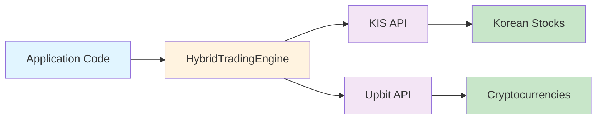

---
hide:
  - navigation
  - toc
---

# 🚀 Hybrid Trader

**하이브리드 자동매매 시스템을 위한 통합 파이썬 라이브러리**

한국투자증권(KIS) API와 업비트(Upbit) API를 하나로 통합하여, 주식과 암호화폐를 동시에 거래할 수 있는 자동매매 시스템을 **단 몇 줄의 코드**로 구축할 수 있습니다.

<div class="grid cards" markdown>

## ✨ 주요 기능

- **🔗 통합 인터페이스** - KIS API와 Upbit API를 하나의 엔진으로 관리
- **🎯 타입 힌트** - 완벽한 타입 힌트로 IDE 자동완성 지원
- **✨ 클린 코드** - 복잡한 API 호출을 감싸서 깔끔한 사용 경험 제공
- **🔄 재시도 로직** - 자동 재시도 기능으로 안정적인 거래 지원
- **📊 로깅 & 모니터링** - 상세한 로깅으로 디버깅 및 실시간 모니터링
- **🔐 Context Manager** - `with` 문법으로 안전한 세션 관리

</div>

---

## 🎯 빠른 시작

### 3단계로 시작하기

```python
from hybrid_trader import HybridTradingEngine, TradingConfig, KISConfig, UpbitConfig

# 1️⃣ API 설정 구성
kis_config = KISConfig(
    app_key="YOUR_KIS_APP_KEY",
    secret_key="YOUR_KIS_SECRET_KEY",
    account_number="1234-5678",
    hts_id="YOUR_HTS_ID",
    is_demo=True
)

upbit_config = UpbitConfig(
    access_key="YOUR_UPBIT_ACCESS_KEY",
    secret_key="YOUR_UPBIT_SECRET_KEY"
)

# 2️⃣ 트레이딩 엔진 초기화
config = TradingConfig(kis_config=kis_config, upbit_config=upbit_config)
engine = HybridTradingEngine(config)

# 3️⃣ 현재가 조회
samsung_price = engine.get_stock_price("005930")  # 삼성전자
bitcoin_price = engine.get_coin_price("KRW-BTC")  # 비트코인
print(f"삼성전자: {samsung_price:,.0f} KRW")
print(f"비트코인: {bitcoin_price:,.0f} KRW")
```

---

## 📦 설치

### pip로 간단하게 설치

```bash
pip install hybrid-trader
```

### 또는 GitHub에서 직접 설치

```bash
git clone https://github.com/YuMyeongJun/hybrid-trader.git
cd hybrid-trader
pip install -r requirements.txt
```

**[자세한 설치 가이드 →](getting-started/installation.md)**

---

## 🎓 배우기

=== "초급"

    **Hybrid Trader를 처음 사용한다면?**
    
    1. [설치 가이드](getting-started/installation.md) 읽기
    2. [빠른 시작](getting-started/quickstart.md) 튜토리얼 따라하기
    3. [기본 예제](guide/examples.md) 실행해보기

=== "중급"

    **더 깊이 이해하고 싶다면?**
    
    1. [아키텍처](guide/architecture.md) 이해하기
    2. [고급 설정](guide/configuration.md) 배우기
    3. [API 레퍼런스](api/overview.md) 확인하기

=== "고급"

    **프로덕션 배포를 계획한다면?**
    
    1. [아키텍처 및 설계](guide/architecture.md) 심화 학습
    2. [실제 거래 예제](guide/examples.md) 분석
    3. [문제 해결](guide/troubleshooting.md) 가이드 숙지

---

## 📚 문서 네비게이션

| 섹션 | 설명 |
|------|------|
| **[Getting Started](getting-started/installation.md)** | 설치 및 기본 설정 가이드 |
| **[Quick Start](getting-started/quickstart.md)** | 5분 안에 시작하기 |
| **[Architecture](guide/architecture.md)** | 시스템 구조 및 설계 원리 |
| **[Examples](guide/examples.md)** | 다양한 사용 사례 및 코드 예제 |
| **[API Reference](api/overview.md)** | 완전한 API 문서 |
| **[FAQ](resources/faq.md)** | 자주 묻는 질문 |
| **[Contributing](resources/contributing.md)** | 기여 가이드 |

---

## 💡 사용 사례

### 📈 주식 자동매매
```python
# 주식 가격 모니터링 및 자동 거래
samsung_price = engine.get_stock_price("005930")
if samsung_price < target_price:
    engine.buy_stock("005930", quantity=10)
```

### 🪙 암호화폐 거래
```python
# 비트코인 실시간 모니터링
btc_price = engine.get_coin_price("KRW-BTC")
if btc_price > sell_price:
    engine.sell_coin("KRW-BTC", amount=1000000)
```

### 🎯 포트폴리오 분석
```python
# 통합 포트폴리오 모니터링
monitor = PortfolioMonitor(engine)
snapshot = monitor.get_portfolio_snapshot()
```

---

## ⚙️ 핵심 컴포넌트



---

## 🔒 보안

API 키는 절대 코드에 하드코딩하지 마세요! 환경변수를 사용하세요:

```bash
export KIS_APP_KEY="your_key"
export KIS_SECRET_KEY="your_secret"
export UPBIT_ACCESS_KEY="your_access_key"
export UPBIT_SECRET_KEY="your_secret_key"
```

[보안 가이드 →](getting-started/installation.md#-보안-가이드)

---

## 📊 지원하는 기능

| 기능 | 주식 (KIS) | 암호화폐 (Upbit) |
|------|:---:|:---:|
| 현재가 조회 | ✅ | ✅ |
| 호가 조회 | ✅ | ✅ |
| 주문 | ✅ | ✅ |
| 주문 취소 | ✅ | ✅ |
| 포지션 조회 | ✅ | ✅ |
| 거래 내역 | ✅ | ✅ |
| 실시간 모니터링 | ✅ | ✅ |
| 포트폴리오 분석 | ✅ | ✅ |

---

## 🤝 커뮤니티

- 📝 [이슈 제보](https://github.com/YuMyeongJun/hybrid-trader/issues)
- 💬 [토론](https://github.com/YuMyeongJun/hybrid-trader/discussions)
- 🚀 [기여하기](resources/contributing.md)

---

## 📄 라이선스

이 프로젝트는 **MIT 라이선스** 하에 배포됩니다.

---

## ⭐ 지원하기

이 프로젝트가 도움이 되었다면 GitHub에서 ⭐를 눌러주세요!

<div align="center">

**[📖 문서 보기](#-문서-네비게이션)** • **[🚀 설치하기](#-설치)** • **[💬 피드백 남기기](https://github.com/YuMyeongJun/hybrid-trader/issues)**

**Made with ❤️ for traders and developers**

</div>
